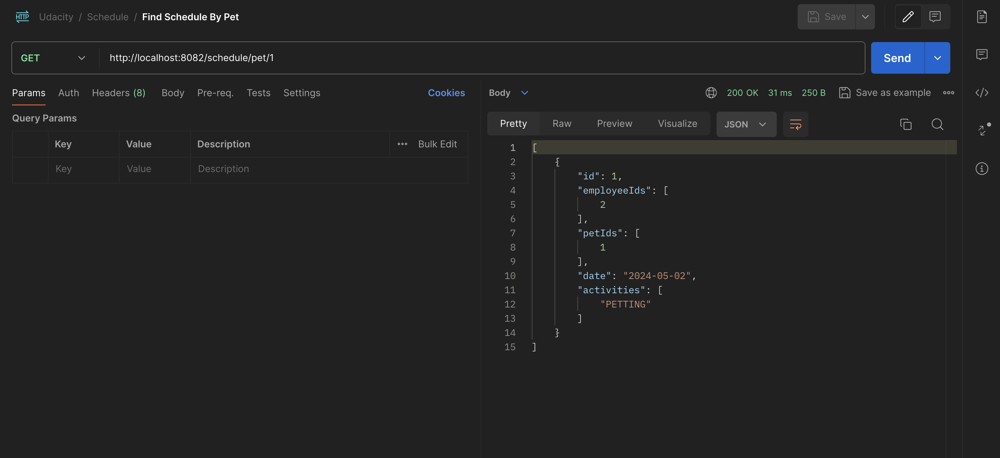

# Critter Chronologer

Critter Chronologer is a Software as a Service application that provides a scheduling interface for a small business that takes care of animals. This Spring Boot project will allow users to create pets, owners, and employees, and then schedule events for employees to provide services for pets.

## Project Overview

The Critter Chronologer project is part of the Java Web Developer Nanodegree program at Udacity. It has following features:

- Data Persistence Using Spring JPA & MySQL
- Repository Pattern in Data Layer
- Service & Controller Layer

# Architecture

## Project Rubric

For detailed information about the project requirements and rubric, please refer to the [project rubric](https://learn.udacity.com/rubric/2787).

## Prerequisites

- Java JDK v17 or above
- MySQL server running on Port 3306 & Database `critter` exists

## Installation

To run the application locally, follow these steps:

1. Clone the repository: `git clone https://github.com/kmanadkat/udnd-java-prj3-chronologer`
2. Navigate to the project directory: `cd udnd-java-prj3-chronologer`
3. Build the project: `./mvnw package`
4. Run the application: `./mvnw spring-boot:run`
5. Open your web browser and visit: `http://localhost:8080`

## Technologies Used

- Java
- Spring Boot
- MySQL
- Spring JPA

## Submission

#### Check Availability

#### Save Schedule

#### Find Schedule By Owner

#### Find Schedule By Pet

#### Find Schedule By Employee

## License

This project is licensed under the [MIT License](https://opensource.org/licenses/MIT).
